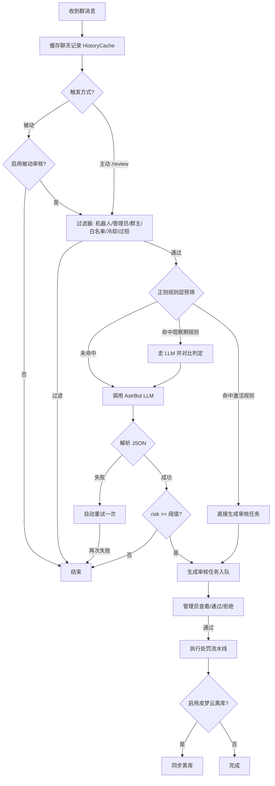

<!-- 请在发布前把本文件中的示例令牌、路径与账号替换为你自己的实际值。 -->

# astrbot_plugin_ai_review

基于 AstrBot 大模型的群聊 AI 审核助手。利用 AstrBot 已接入的大语言模型对群成员聊天记录进行分析，为管理员生成审核建议；AI 仅负责辅助审核，所有处罚行为必须由管理员确认后执行。

[](LICENSE)

## 功能

- **主动审核**：`/review @成员`、`/review <uid>`、`/review recent`，管理员随时发起审核
- **被动自主审核**：收到群消息后后台自动分析（可配置触发模式，不阻塞消息响应），支持独立开关
- **被动审核开关**：可在配置面板或 `/review auto on|off` 命令中随时开关被动自主审核
- **正则规则引擎**：将反复出现的违规模式提炼为规则候选（`data/prompts/rule.txt`），定期推送审批请求（目标可配置：来源群聊天 / 指定管理员私聊 / 关闭，`/reviewconfig group <群号> regex_push_target group|admin|off`），管理员 `/review rule approve|deny` 确认后才进入观察期；观察期命中仍走 AI 对比验证，准确率达标自动激活，不足自动熔断停用，大幅节省 token
- **按群配置覆盖**：不同群可独立设置阈值、开关与处罚参数（`/reviewconfig group`）
- **处罚策略**：warn / mute / kick / ban / blacklist，流水线模式，可配置扩展
- **皮梦云黑库同步**：通过 Adapter 弱依赖接入，存在即同步、缺失自动跳过
- **配置热加载**：配置修改后即时生效（含处罚配置）
- **LLM 调用加固**：网络失败自动退避重试，采样温度可配置（默认 0.3 保证一致性）
- **数据持久化**：待审核任务、冷却表、违规统计与按群配置通过 AstrBot 官方 KV 存储持久化，重启不丢
- **队列治理**：同一用户待处理任务数与全局队列总量可配置上限，防止刷屏堆积

## 安装

1. 在 AstrBot 中进入「插件管理」→「插件市场」搜索 `astrbot_plugin_ai_review` 或手动安装；
2. 或在 AstrBot 的 `data/plugins` 目录下 clone 本仓库并安装依赖：
   ```bash
   git clone https://github.com/Ni-ShuWu/astrbot_plugin_ai_review.git
   cd astrbot_plugin_ai_review
   pip install -r requirements.txt
   ```
3. 确认已配置可用的对话模型 Provider（聊天类模型）。
4. 重载 / 重启 AstrBot 后，插件即自动启用。

## 快速开始

1. 将机器人拉入群聊；
2. 让机器人保持在线，群内聊天记录会自动缓存；
3. 管理员在群内发送 `/review @违规成员` 或 `/review recent` 主动审核；
4. 默认同时启用被动审核：机器人会在后台自动分析群消息，生成待审核任务；
5. 管理员用 `/review list` 查看任务，`/review detail <id>` 查看详情，`/review pass <id>` 通过并处罚，`/review reject <id>` 拒绝。

> 若主动审核提示「无历史记录」，说明该群消息还未被缓存（被动模式关闭或缓存开关未开启），可稍后再试或确认 `enable_history` 配置。

## 工作原理



## 审核流程

1. 群消息自动缓存到内存（每群最近 N 条，默认 50）。
2. 触发方式：管理员主动 `/review` 或被动自动分析。
3. AI 调用前先过滤：机器人、管理员、群主、白名单、冷却中用户、空消息、过短消息。
4. 若命中已激活正则规则，直接生成审核任务（跳过 LLM，节省 token）。
5. 否则将最近聊天记录构造 Prompt 调用 AstrBot LLM。
6. LLM 返回 JSON 审核结果（illegal / risk / type / reason / evidence / suggestion）。
7. 若 risk 低于阈值，结束；否则生成审核任务加入审核队列。
8. 管理员通过后执行处罚流水线（warn → mute → kick → ban → blacklist 等），可选同步皮梦云黑库。

## Prompt 维护

Prompt 文本独立存放于 `data/prompts/`（或配置 `prompt_path` 指向的自定义目录），修改文件后无需重启，自动生效：

| 文件 | 作用 |
|------|------|
| `system.txt` | 系统提示词：审核规则、数据边界、宁缺毋滥原则 |
| `user.txt` | 用户提示词模板：聊天记录组装与占位符 |
| `output.txt` | 输出约束：仅返回 JSON，字段与取值说明 |
| `reason.txt` | 审核原因模板：注入到输出提示词 |
| `rule.txt` | 正则规则引擎预筛提示词：从违规消息提炼正则模式 |

### 配置热加载

所有配置通过统一的 `ConfigManager` 读取，各模块在执行前通过 `get_config` 回调同步最新值，
修改配置（面板 / `/reviewconfig`）后即时生效，无需重启。

### 数据持久化

待审核任务队列、冷却表、违规统计与按群覆盖配置均通过 AstrBot 官方插件 KV 存储
（`put_kv_data` / `get_kv_data`）持久化，插件重启后自动恢复。

## 配置（后端配置操作）

### 配置方式一：AstrBot 管理面板（推荐）

1. 打开 AstrBot 管理面板；
2. 进入「插件管理」→「已安装插件」→ `astrbot_plugin_ai_review`；
3. 点击「配置 / 设置」进入表单，按需修改各项参数并保存；

> 提示：在配置面板中修改 `llm_provider_id` 可直接固定审核使用的模型 Provider ID，留空则跟随会话默认模型。

### 配置方式二：/reviewconfig 命令（管理员）

```
/reviewconfig                 查看当前全部配置
/reviewconfig <key> <value>   修改配置并持久化
```

- 布尔类配置（如 `enable_passive_review`）接受 `true/false`、`1/0`、`yes/no`、`on/off`；
- 列表类配置（如 `whitelist`、`admin_qq`）用英文逗号分隔；
- JSON 类配置（如 `punish_pipeline`）支持直接粘贴含空格的完整 JSON；
- 数值类配置自动做范围校验；
- 修改成功后立即生效，并同步持久化到 AstrBot 配置文件中。

### 配置方式三：手动编辑配置文件

配置实际存储于 AstrBot 的配置目录中（通常为 AstrBot 根目录下的 `data/config/astrbot_plugin_ai_review_config.json`）：

```json
{
  "history_count": 50,
  "review_mode": "both",
  "enable_passive_review": true,
  "risk_threshold": 80
}
```

> 不建议在插件运行时手动编辑文件，配置可能被内存中的值覆盖。

### 配置项总表

| 配置项 | 类型 | 默认值 | 说明 |
|--------|------|--------|------|
| `history_count` | int | 50 | 每个群缓存最近聊天条数 |
| `review_mode` | string | both | 触发模式：`active`（仅主动）/ `passive`（仅被动）/ `both` |
| `enable_passive_review` | bool | true | 是否启用被动自主审核（关闭后群消息仍缓存但不再自动触发 AI 审核） |
| `risk_threshold` | int | 80 | AI 风险值低于该值视为不违规 |
| `review_timeout` | int | 300 | 审核任务超时（秒），超时自动失效 |
| `cooldown` | int | 300 | 同一用户两次自动审核最小间隔（秒） |
| `enable_blacklist` | bool | false | 是否启用皮梦云黑库同步 |
| `enable_history` | bool | true | 是否启用聊天记录缓存（关闭后主动审核 `uid` 无历史可用） |
| `prompt_path` | string | 空 | 自定义 Prompt 目录，留空使用内置 `data/prompts` |
| `whitelist` | list | [] | 白名单用户 ID，不参与自动审核 |
| `min_msg_len` | int | 2 | 短于该长度的消息不触发被动审核 |
| `llm_max_concurrency` | int | 3 | 同时进行的模型请求数上限（最小 1） |
| `llm_provider_id` | string | 空 | 固定审核使用的 AstrBot 模型 Provider ID；留空跟随会话默认模型（`/provider` 切换） |
| `llm_temperature` | float | 0.3 | AI 采样温度（0~2），建议保持低温度保证审核一致性 |
| `mute_duration` | int | 600 | mute 处罚禁言时长（秒） |
| `admin_qq` | list | [] | AI 调用异常时向其发送告警私聊的管理员 QQ |
| `max_chat_chars` | int | 3000 | 发送给 AI 的聊天记录总字符预算，超出丢弃更早的记录 |
| `max_msg_chars` | int | 200 | 单条消息发送给 AI 的字符上限，超出截断 |
| `punish_pipeline` | object | {} | 处罚流水线映射（键为建议处罚，值为有序阶段列表） |
| `max_pending_per_user` | int | 2 | 同一群内同一用户最多同时存在的待处理任务数 |
| `max_pending_total` | int | 200 | 全局待处理任务总数上限 |
| `enable_regex_prefilter` | bool | true | 启用正则预筛选（命中已激活规则跳过 LLM） |
| `regex_sediment` | bool | true | 启用规则自动沉淀（管理员通过后提炼正则候选） |
| `regex_min_hits` | int | 5 | 规则激活/熔断所需最小判定次数 |
| `regex_min_accuracy` | float | 0.7 | 规则最低准确率（0~1），低于该值自动停用 |
| `regex_max_rules` | int | 200 | 正则规则数量上限 |
| `regex_push_interval` | int | 30 | 沉淀推送间隔（分钟），0 关闭自动推送 |
| `regex_candidate_ttl` | int | 3 | 候选规则保留天数 |
| `regex_push_target` | string | group | 沉淀推送目标：group / admin / off |
| `regex_push_admin` | list | [] | 私聊推送的管理员 QQ（留空用全局 admin_qq） |

### 常见配置场景

- **仅主动审核**：`review_mode=active`（群消息只缓存，不自动分析）
- **仅被动审核**：`review_mode=passive`；若同时关闭缓存（`enable_history=false`），每次以触发消息本身为上下文审核
- **临时关闭被动自主审核**：`/review auto off` 或配置 `enable_passive_review=false`（群消息照常缓存，主动 `/review` 命令不受影响）
- **降低误报**：`risk_threshold=85` 或调高 `min_msg_len`、增加白名单
- **提高敏感度**：`risk_threshold=70`
- **避免同一用户频繁触发**：调大 `cooldown`
- **某群单独放宽/收紧**：`/reviewconfig group <群号> risk_threshold 85`（支持阈值、模式、被动开关、冷却、处罚参数等）
- **自定义处罚**：`punish_pipeline={"kick": ["warn", "kick"]}`
- **固定审核模型**：`/review provider` 查看已接入的模型，`/reviewconfig llm_provider_id <Provider ID>` 固定审核使用的模型；留空则跟随会话默认模型
- **接入皮梦云黑库**：`enable_blacklist=true`，并确保皮梦云插件已启用且配置了 Bot Token
- **管理员告警**：`admin_qq=["10000"]`（AI 调用失败时私聊通知）

## 命令（管理员）

| 命令 | 说明 |
|------|------|
| `/review @成员` | 审核指定群成员（@ 提及） |
| `/review <uid>` | 审核指定 QQ / 平台用户 ID |
| `/review recent` | 审核最近整段聊天记录 |
| `/review provider` | 列出 AstrBot 已接入的对话模型 |
| `/review auto on` | 开启被动自主审核 |
| `/review auto off` | 关闭被动自主审核 |
| `/review list` | 查看待审核任务（最多 10 条） |
| `/review stats` | 查看本群违规统计 |
| `/review stats all` | 查看全部群违规统计 |
| `/review detail <id>` | 查看任务详情（证据、聊天上下文） |
| `/review pass <id>` | 通过任务并执行处罚流水线 |
| `/review reject <id>` | 拒绝任务（不处罚，仅记录日志） |
| `/review rule list` | 查看正则规则列表 |
| `/review rule pending` | 查看待审批候选规则 |
| `/review rule approve <id>` | 批准候选规则（进入观察期） |
| `/review rule deny <id>` | 拒绝候选规则 |
| `/review rule add <pattern> [level]` | 手动添加正则规则（1~3 级） |
| `/review rule disable <id>` | 停用规则 |
| `/review rule enable <id>` | 启用规则 |
| `/review rule del <id>` | 删除规则 |
| `/reviewconfig` | 查看全部配置 |
| `/reviewconfig <key> <value>` | 修改配置并持久化 |
| `/reviewconfig group <群号> [key value\|reset]` | 查看 / 设置 / 清除按群覆盖配置 |

> 所有命令均为管理员权限；`/review` 与 `/reviewconfig` 需在群内或私聊使用。

## 皮梦云黑库

若已安装并启用皮梦云黑库插件（`astrbot_plugin_pimeng_blacklist`），且配置 `enable_blacklist=true`，
则审核通过且处罚建议为 `blacklist` 时，自动调用其接口将用户加入黑名单；插件缺失时自动跳过，不影响插件运行。

## 代码结构

```
astrbot_plugin_ai_review/
├── main.py               插件入口：装配各模块、注册命令与消息监听、定时推送循环
├── config.py             配置中心（默认值、类型转换、校验、持久化）
├── models.py             数据模型（dataclass：ChatRecord / ReviewResult / ReviewTask / ReviewLog）
├── prompt.py             Prompt 管理器（目录热加载、占位符替换）
├── review/
│   ├── history.py        聊天记录缓存（deque 自动淘汰）
│   ├── workflow.py       审核工作流（缓存/触发/过滤/LLM/解析/入队/日志）
│   ├── queue.py          审核任务队列（查看/通过/拒绝/超时失效，KV 持久化）
│   ├── filters.py        消息过滤与冷却（KV 持久化）
│   ├── rules.py          正则规则引擎（预筛/观察期/激活/熔断）
│   ├── punish_stages.py  处罚阶段定义
│   ├── punishment.py     处罚执行（策略模式 + 流水线）
│   ├── persistence.py     KV 存储封装
│   └── stats.py           违规统计（KV 持久化）
├── commands/
│   ├── review.py         /review 命令 mixin
│   └── config.py         /reviewconfig 命令 mixin
├── adapters/
│   └── pimeng.py         皮梦云黑库 Adapter（弱依赖）
├── utils/
│   ├── llm.py            AstrBot LLM 调用客户端（限流/重试/告警）
│   ├── parser.py         LLM 回复 JSON 解析与重试
│   └── logger.py         日志封装
├── data/prompts/         Prompt 文件（system/user/output/reason/rule）
├── tests/                unittest 测试
├── metadata.yaml         插件元数据
└── _conf_schema.json     配置面板 schema
```

## 开发与测试

```bash
python -m unittest discover -s tests -v
```

## 常见问题

- **修改配置后不生效**：管理面板或 `/reviewconfig` 修改后即时生效；手动编辑配置文件需重载插件或重启。
- **皮梦云黑库未同步**：确认 `enable_blacklist=true`、皮梦云插件已启用并配置 Bot Token、执行的是 `blacklist` 建议处罚。
- **插件加载报 `KeyError: 'items'`**：`_conf_schema.json` 中 `punish_pipeline` 已补齐 `items` 子结构，无需处理。
